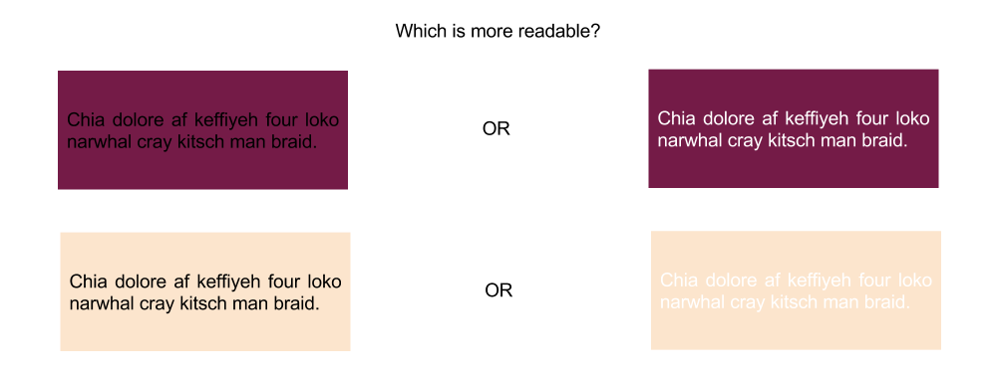

# Contrast neural net

This a simple deep neural network that learns the yiq contrast formula with over 95% accuracy. This formula determins wether some text would be more visible in white or in black given a certain background color.



### Dependencies
* Python 3
* Numpy
* Tensorflow or Theano
* Keras
* h5py

### Training

```
$ python net.py train
```

### Running with previously trained model
```
$ python net.py
```